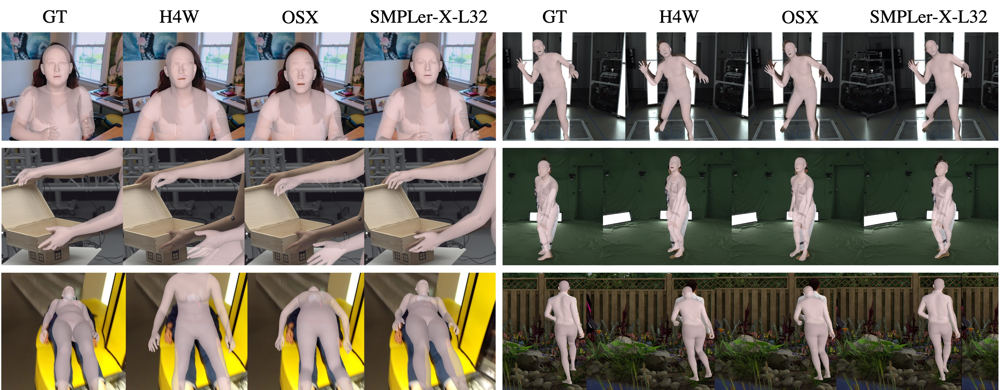

# SMPLer-X: Scaling Up Expressive Human Pose and Shape Estimation


## Useful links

<div align="center">
    <a href="https://caizhongang.github.io/projects/SMPLer-X/" class="button"><b>[Homepage]</b></a> &nbsp;&nbsp;&nbsp;&nbsp;
    <a href="https://arxiv.org/abs/2309.17448" class="button"><b>[arXiv]</b></a> &nbsp;&nbsp;&nbsp;&nbsp;
    <a href="https://youtu.be/DepTqbPpVzY" class="button"><b>[Video]</b></a> &nbsp;&nbsp;&nbsp;&nbsp;
    <a href="https://github.com/open-mmlab/mmhuman3d" class="button"><b>[MMHuman3D]</b></a>
</div>

## News
- [2023-10-23] Support visualization through SMPL-X mesh overlay and add inference docker. 
- [2023-10-02] [arXiv](https://arxiv.org/abs/2309.17448) preprint is online!
- [2023-09-28] [Homepage](https://caizhongang.github.io/projects/SMPLer-X/) and [Video](https://youtu.be/DepTqbPpVzY) are online!
- [2023-07-19] Pretrained models are released.
- [2023-06-15] Training and testing code is released.

## Gallery
|  |   |   |  
|:--------------------------------------:|:-----------------------------:|:-----------------------------:|
|            |   |   |




## Install
```bash
conda create -n smplerx python=3.8 -y
conda activate smplerx
conda install pytorch==1.12.0 torchvision==0.13.0 torchaudio==0.12.0 cudatoolkit=11.3 -c pytorch -y
pip install mmcv-full==1.7.1 -f https://download.openmmlab.com/mmcv/dist/cu113/torch1.12.0/index.html
pip install -r requirements.txt

# install mmpose
cd main/transformer_utils
pip install -v -e .
cd ../..
```

## Docker Support (Early Stage)
```
docker pull wcwcw/smplerx_inference:v0.2
docker run  --gpus all -v <vid_input_folder>:/smplerx_inference/vid_input \
        -v <vid_output_folder>:/smplerx_inference/vid_output \
        wcwcw/smplerx_inference:v0.2 --vid <video_name>.mp4
# Currently any customization need to be applied to /smplerx_inference/smplerx/inference_docker.py
```
- We recently developed a docker for inference at docker hub.
- This docker image uses SMPLer-X-H32 as inference baseline and was tested at RTX3090 & WSL2 (Ubuntu 20.04).


## Pretrained Models
|    Model     | Backbone | #Datasets | #Inst. | #Params | MPE  | Download |  FPS  |
|:------------:|:--------:|:---------:|:------:|:-------:|:----:|:--------:|:-----:|
| SMPLer-X-S32 |  ViT-S   |    32 |  4.5M  |   32M | 82.6 | [model](https://pjlab-my.sharepoint.cn/:u:/g/personal/openmmlab_pjlab_org_cn/EbkyKOS5PclHtDSxdZDmsu0BNviaTKUbF5QUPJ08hfKuKg?e=LQVvzs) | 36.17 |
| SMPLer-X-B32 |  ViT-B   |    32 |  4.5M  |  103M | 74.3 | [model](https://pjlab-my.sharepoint.cn/:u:/g/personal/openmmlab_pjlab_org_cn/EVcRBwNOQl9OtWhnCU54l58BzJaYEPxcFIw7u_GnnlPZiA?e=nPqMjz) | 33.09 |
| SMPLer-X-L32 |  ViT-L   |    32 |  4.5M  |  327M | 66.2 | [model](https://pjlab-my.sharepoint.cn/:u:/g/personal/openmmlab_pjlab_org_cn/EWypJXfmJ2dEhoC0pHFFd5MBoSs7LCZmWQjHjbcQJF72fQ?e=Gteus3) | 24.44 |
| SMPLer-X-H32 |  ViT-H   |    32 |  4.5M  |  662M | 63.0 | [model](https://pjlab-my.sharepoint.cn/:u:/g/personal/openmmlab_pjlab_org_cn/Eco7AAc_ZmtBrhAat2e5Ti8BonrR3NVNx-tNSck45ixT4Q?e=nudXrR) | 17.47 |
* MPE (Mean Primary Error): the average of the primary errors on five benchmarks (AGORA, EgoBody, UBody, 3DPW, and EHF)
* FPS (Frames Per Second): the average inference speed on a single Tesla V100 GPU, batch size = 1

## Preparation
- download all datasets
  - [3DPW](https://virtualhumans.mpi-inf.mpg.de/3DPW/)
  - [AGORA](https://agora.is.tue.mpg.de/index.html)       
  - [ARCTIC](https://arctic.is.tue.mpg.de/)      
  - [BEDLAM](https://bedlam.is.tue.mpg.de/index.html)      
  - [BEHAVE](https://github.com/xiexh20/behave-dataset)      
  - [CHI3D](https://ci3d.imar.ro/)       
  - [CrowdPose](https://github.com/Jeff-sjtu/CrowdPose)   
  - [EgoBody](https://sanweiliti.github.io/egobody/egobody.html)     
  - [EHF](https://smpl-x.is.tue.mpg.de/index.html)         
  - [FIT3D](https://fit3d.imar.ro/)                
  - [GTA-Human](https://caizhongang.github.io/projects/GTA-Human/)           
  - [Human3.6M](http://vision.imar.ro/human3.6m/description.php)             
  - [HumanSC3D](https://sc3d.imar.ro/)            
  - [InstaVariety](https://github.com/akanazawa/human_dynamics/blob/master/doc/insta_variety.md)         
  - [LSPET](http://sam.johnson.io/research/lspet.html)                
  - [MPII](http://human-pose.mpi-inf.mpg.de/)                 
  - [MPI-INF-3DHP](https://vcai.mpi-inf.mpg.de/3dhp-dataset/)         
  - [MSCOCO](https://cocodataset.org/#home)               
  - [MTP](https://tuch.is.tue.mpg.de/)                    
  - [MuCo-3DHP](https://vcai.mpi-inf.mpg.de/projects/SingleShotMultiPerson/)                   
  - [OCHuman](https://github.com/liruilong940607/OCHumanApi)                
  - [PoseTrack](https://posetrack.net/)                
  - [PROX](https://prox.is.tue.mpg.de/)                   
  - [RenBody](https://magichub.com/datasets/openxd-renbody/)
  - [RICH](https://rich.is.tue.mpg.de/index.html)
  - [SPEC](https://spec.is.tue.mpg.de/index.html)
  - [SSP3D](https://github.com/akashsengupta1997/SSP-3D)
  - [SynBody](https://maoxie.github.io/SynBody/)
  - [Talkshow](https://talkshow.is.tue.mpg.de/)
  - [UBody](https://github.com/IDEA-Research/OSX)
  - [UP3D](https://files.is.tuebingen.mpg.de/classner/up/)
- process all datasets into [HumanData](https://github.com/open-mmlab/mmhuman3d/blob/main/docs/human_data.md) format, except the following:
  - AGORA, MSCOCO, MPII, Human3.6M, UBody. 
  - follow [OSX](https://github.com/IDEA-Research/OSX) in preparing these 5 datasets.
- follow [OSX](https://github.com/IDEA-Research/OSX) in preparing pretrained ViTPose models. Download the ViTPose pretrained weights for ViT-small and ViT-huge from [here](https://github.com/ViTAE-Transformer/ViTPose).
- download [SMPL-X](https://smpl-x.is.tue.mpg.de/) and [SMPL](https://smpl.is.tue.mpg.de/) body models.
- download mmdet pretrained [model](https://download.openmmlab.com/mmdetection/v2.0/faster_rcnn/faster_rcnn_r50_fpn_1x_coco/faster_rcnn_r50_fpn_1x_coco_20200130-047c8118.pth) and [config](https://github.com/openxrlab/xrmocap/blob/main/configs/modules/human_perception/mmdet_faster_rcnn_r50_fpn_coco.py) for inference.

The file structure should be like:
```
SMPLer-X/
├── common/
│   └── utils/
│       └── human_model_files/  # body model
│           ├── smpl/
│           │   ├──SMPL_NEUTRAL.pkl
│           │   ├──SMPL_MALE.pkl
│           │   └──SMPL_FEMALE.pkl
│           └── smplx/
│               ├──MANO_SMPLX_vertex_ids.pkl
│               ├──SMPL-X__FLAME_vertex_ids.npy
│               ├──SMPLX_NEUTRAL.pkl
│               ├──SMPLX_to_J14.pkl
│               ├──SMPLX_NEUTRAL.npz
│               ├──SMPLX_MALE.npz
│               └──SMPLX_FEMALE.npz
├── data/
├── main/
├── demo/  
│   ├── videos/       
│   ├── images/      
│   └── results/ 
├── pretrained_models/  # pretrained ViT-Pose, SMPLer_X and mmdet models
│   ├── mmdet/
│   │   ├──faster_rcnn_r50_fpn_1x_coco_20200130-047c8118.pth
│   │   └──mmdet_faster_rcnn_r50_fpn_coco.py
│   ├── smpler_x_s32.pth.tar
│   ├── smpler_x_b32.pth.tar
│   ├── smpler_x_l32.pth.tar
│   ├── smpler_x_h32.pth.tar
│   ├── vitpose_small.pth
│   ├── vitpose_base.pth
│   ├── vitpose_large.pth
│   └── vitpose_huge.pth
└── dataset/  
    ├── AGORA/       
    ├── ARCTIC/      
    ├── BEDLAM/      
    ├── Behave/      
    ├── CHI3D/       
    ├── CrowdPose/   
    ├── EgoBody/     
    ├── EHF/         
    ├── FIT3D/                
    ├── GTA_Human2/           
    ├── Human36M/             
    ├── HumanSC3D/            
    ├── InstaVariety/         
    ├── LSPET/                
    ├── MPII/                 
    ├── MPI_INF_3DHP/         
    ├── MSCOCO/               
    ├── MTP/                    
    ├── MuCo/                   
    ├── OCHuman/                
    ├── PoseTrack/                
    ├── PROX/                   
    ├── PW3D/                   
    ├── RenBody/
    ├── RICH/
    ├── SPEC/
    ├── SSP3D/
    ├── SynBody/
    ├── Talkshow/
    ├── UBody/
    ├── UP3D/
    └── preprocessed_datasets/  # HumanData files
```
## Inference 
- Place the video for inference under `SMPLer-X/demo/videos`
- Prepare the pretrained models to be used for inference under `SMPLer-X/pretrained_models`
- Prepare the mmdet pretrained model and config under `SMPLer-X/pretrained_models`
- Inference output will be saved in `SMPLer-X/demo/results`

```bash
cd main
sh slurm_inference.sh {VIDEO_FILE} {FORMAT} {FPS} {PRETRAINED_CKPT} 

# For inferencing test_video.mp4 (24FPS) with smpler_x_h32
sh slurm_inference.sh test_video mp4 24 smpler_x_h32

```
## 2D Smplx Overlay
We provide a lightweight visualization script for mesh overlay based on pyrender.
- Use ffmpeg to split video into images
- The visualization script takes inference results (see above) as the input.
```bash
ffmpeg -i {VIDEO_FILE} -f image2 -vf fps=30 \
        {SMPLERX INFERENCE DIR}/{VIDEO NAME (no extension)}/orig_img/%06d.jpg \
        -hide_banner  -loglevel error

cd main && python render.py \
            --data_path {SMPLERX INFERENCE DIR} --seq {VIDEO NAME} \
            --image_path {SMPLERX INFERENCE DIR}/{VIDEO NAME} \
            --render_biggest_person False
```


## Training
```bash
cd main
sh slurm_train.sh {JOB_NAME} {NUM_GPU} {CONFIG_FILE}

# For training SMPLer-X-H32 with 16 GPUS
sh slurm_train.sh smpler_x_h32 16 config_smpler_x_h32.py

```
- CONFIG_FILE is the file name under `SMPLer-X/main/config`
- Logs and checkpoints will be saved to `SMPLer-X/output/train_{JOB_NAME}_{DATE_TIME}`


## Testing
```bash
# To eval the model ../output/{TRAIN_OUTPUT_DIR}/model_dump/snapshot_{CKPT_ID}.pth.tar 
# with confing ../output/{TRAIN_OUTPUT_DIR}/code/config_base.py
cd main
sh slurm_test.sh {JOB_NAME} {NUM_GPU} {TRAIN_OUTPUT_DIR} {CKPT_ID}
```
- NUM_GPU = 1 is recommended for testing
- Logs and results  will be saved to `SMPLer-X/output/test_{JOB_NAME}_ep{CKPT_ID}_{TEST_DATSET}`


## FAQ
- `RuntimeError: Subtraction, the '-' operator, with a bool tensor is not supported. If you are trying to invert a mask, use the '~' or 'logical_not()' operator instead.`
  
  Follow [this post](https://github.com/mks0601/I2L-MeshNet_RELEASE/issues/6#issuecomment-675152527) and modify `torchgeometry`

- `KeyError: 'SinePositionalEncoding is already registered in position encoding'` or any other similar KeyErrors due to duplicate module registration.

  Manually add `force=True` to respective module registration under `main/transformer_utils/mmpose/models/utils`, e.g. `@POSITIONAL_ENCODING.register_module(force=True)` in [this file](main/transformer_utils/mmpose/models/utils/positional_encoding.py)

- How do I animate my virtual characters with SMPLer-X output (like that in the demo video)? 
  - We are working on that, please stay tuned!
    Currently, this repo supports SMPL-X estimation and a simple visualization (overlay of SMPL-X vertices).

## References
- [Hand4Whole](https://github.com/mks0601/Hand4Whole_RELEASE)
- [OSX](https://github.com/IDEA-Research/OSX)
- [MMHuman3D](https://github.com/open-mmlab/mmhuman3d)
